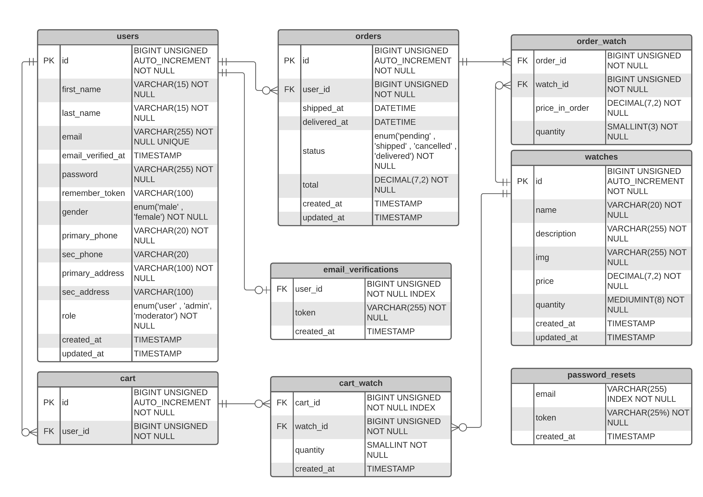

# Timezone - Watch Shop

## Idea

Backend RESTful API for selling watches online. It's designed to be owned by a store or a brand. Built in ***Laravel*** 

### Check [Reference Documentation](https://github.com/YoussefMRefaat/timezone/wiki) for details about endpoints

## Features

There are four types of roles in this application :-
- Moderator
- Admin
- User
- Guest

#### All authenticated accounts can :-
1- Update account information and password  
2- Logout

#### Moderators can :-
1- Create, read, and delete accounts of admins  
2- all admins' features

#### Admins can :-
1- Create, update, read, and delete watches  
2- Read users' information and their orders  
3- Read all orders  
4- Update orders to be shipped, delivered, or cancelled

#### Users can :-
1- Read watches (in less details than admins)  
2- Add watches to the cart  
3- Show cart's details  
4- Update the quantity of a watch in the cart   
5- Delete watches from the cart  
6- Make an order  
7- Show and track their orders  

#### Guests can :-
1- Signup  
2- Login  
3- Reset password  
4- Read watches

Moderators' accounts should be provided by the developer.  

Run `php artisan db:seed` to seed a moderator with email= `moderator@test` and password=`123456`    

## Entity relationship diagram

## Packages
[Laravel Sanctum](https://laravel.com/docs/8.x/sanctum)  

## License

[MIT license](https://opensource.org/licenses/MIT).

